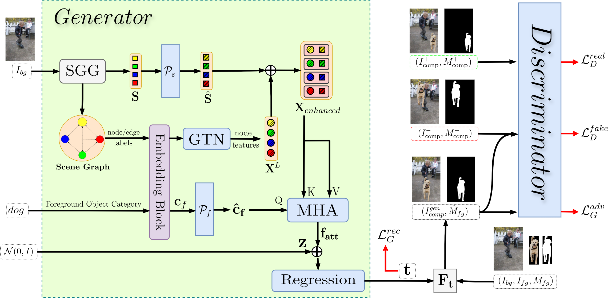

# GraPLUS: Graph-based Placement Using Semantics for Image Composition

[](https://arxiv.org/abs/2503.15761)

**Mir Mohammad Khaleghi, Mehran Safayani, Abdolreza Mirzaei**  
Department of Electrical and Computer Engineering, Isfahan University of Technology, Isfahan, Iran



## Abstract

We present GraPLUS, a novel framework for plausible object placement in images that leverages scene graphs and large language models. Our approach uniquely combines graph-structured scene representation with semantic understanding to determine contextually appropriate object positions. The framework employs GPT-2 to transform categorical node and edge labels into rich semantic embeddings that capture both definitional characteristics and typical spatial contexts, enabling nuanced understanding of object relationships and placement patterns.

GraPLUS achieves placement accuracy of 92.1% and an FID score of 28.83 on the OPA dataset, outperforming state-of-the-art methods by 8.1% while maintaining competitive visual quality. In human evaluation studies involving 964 samples assessed by 19 participants, our method was preferred in 52.1% of cases, significantly outperforming previous approaches.

## ⏬ Download Pre-trained Models 

We provide models for **TERSE** (CVPR 2019) [[arXiv]](https://arxiv.org/abs/1904.05475), **PlaceNet** (ECCV 2020) [[arXiv]](https://www.ecva.net/papers/eccv_2020/papers_ECCV/papers/123580562.pdf), **GracoNet** (ECCV 2022) [[arXiv]](https://arxiv.org/abs/2207.11464), **CA-GAN** (ICME 2023, Oral) [[paper]](https://ieeexplore.ieee.org/stamp/stamp.jsp?tp=&arnumber=10219885), **CSANet** (BMVC 2024) [[paper]](https://papers.bmvc2024.org/0165.pdf), and our **GraPLUS**:

|     | method   | Accuracy | FID    | LPIPS  | url of model & logs |
|-----|----------|----------|--------|--------|---------------------|
| 0   | TERSE    | 0.683    | 47.44  | 0.000  | [Google Drive](https://drive.google.com/file/d/1xxxxxxxxxxxxx/view?usp=sharing) |
| 1   | PlaceNet | 0.684    | 37.63  | 0.160  | [Google Drive](https://drive.google.com/file/d/1xxxxxxxxxxxxx/view?usp=sharing) |
| 2   | GracoNet | 0.838    | 29.35  | 0.207  | [Google Drive](https://drive.google.com/file/d/1xxxxxxxxxxxxx/view?usp=sharing) |
| 3   | CA-GAN   | 0.734    | 25.54  | 0.267  | [Google Drive](https://drive.google.com/file/d/1xxxxxxxxxxxxx/view?usp=sharing) |
| 4   | CSANet   | 0.803    | 22.42  | 0.264  | [Google Drive](https://drive.google.com/file/d/1xxxxxxxxxxxxx/view?usp=sharing) |
| 5   | GraPLUS  | 0.921    | 28.83  | 0.055  | [Google Drive](https://drive.google.com/file/d/1xxxxxxxxxxxxx/view?usp=sharing) |

## 🔧 Environment Setup

Install Python 3.6 and PyTorch 1.9.1 (require CUDA >= 10.2):
```bash
conda create -n graplus python=3.6
conda activate graplus
conda install pytorch==1.9.1 torchvision==0.10.1 torchaudio==0.9.1 cudatoolkit=10.2 -c pytorch
```


## 🌓 Data Preparation
Download and extract [OPA](https://github.com/bcmi/Object-Placement-Assessment-Dataset-OPA) dataset from the official link: [google drive](https://drive.google.com/file/d/133Wic_nSqfrIajDnnxwvGzjVti-7Y6PF/view?usp=sharing) or [baidu disk](https://pan.baidu.com/s/1IzVLcXWLFgFR4GAbxZUPkw) (code: a982). We expect the directory structure to be the following:
```
<PATH_TO_OPA>
  background/       # background images
  foreground/       # foreground images with masks
  composite/        # composite images with masks
  train_set.csv     # train annotation
  test_set.csv      # test annotation
```

Then, make some preprocessing:
```
python tool/preprocess.py --data_root <PATH_TO_OPA>
```
You will see some new files and directories:
```
<PATH_TO_OPA>
  com_pic_testpos299/          # test set positive composite images (resized to 299)
  train_data.csv               # transformed train annotation
  train_data_pos.csv           # train annotation for positive samples
  test_data.csv                # transformed test annotation
  test_data_pos.csv            # test annotation for positive samples
  test_data_pos_unique.csv     # test annotation for positive samples with different fg/bg pairs 
```

## 💻 Training
To train GraPLUS, use the provided training script:

```
./train.sh graplus YOUR_EXPERIMENT_NAME
```
For additional configurations, you can add optional parameters:
```
./train.sh graplus YOUR_EXPERIMENT_NAME --batch_size 64 --d_k 64
```
To see the change of losses dynamically, use TensorBoard:

```
tensorboard --logdir result/YOUR_EXPERIMENT_NAME/tblog --port YOUR_SPECIFIED_PORT
```
## 🔥 Inference
To predict composite images from a trained GraPLUS model, run:

```
./infer.sh graplus --epoch EPOCH_TO_EVALUATE --eval_type eval
./infer.sh graplus --epoch EPOCH_TO_EVALUATE --eval_type evaluni --repeat 10
```

You could also directly use our provided models. For example, if you want to infer our best GraPLUS model, please:

Download the model from the link provided above.

Place it under the models/ directory and extract it.

Run:
```
./infer.sh graplus --epoch 21 --eval_type eval
./infer.sh graplus --epoch 21 --eval_type evaluni --repeat 10
```
## 📊 Evaluation
To evaluate all metrics at once, use the evaluation script:
```
./eval.sh graplus EPOCH_TO_EVALUATE
```
This will run the following evaluations:

**Accuracy** evaluation using a binary classifier

**FID** score evaluation for visual quality

**LPIPS** score evaluation for diversity

To view summarized results:

```
python tool/summarize.py --expid YOUR_EXPERIMENT_NAME --eval_type eval
python tool/summarize.py --expid YOUR_EXPERIMENT_NAME --eval_type evaluni
```
Results will be available at result/YOUR_EXPERIMENT_NAME/*_resall.txt.

## ✨ Key Innovations
Semantic-First Approach: We determine optimal placement using only the foreground object's category without requiring the actual foreground image, significantly reducing computational complexity.

**Transfer Learning**: We leverage pre-trained scene graph extraction models that incorporate cross-domain knowledge of common object relationships and spatial arrangements.

**Edge-Aware Graph Neural Networks**: Our model processes scene semantics through structured relationships, preserving and enhancing semantic connections.

**Cross-Modal Attention**: We align categorical embeddings with enhanced scene features through a dedicated attention mechanism.

**Multi-Objective Training**: Our approach incorporates semantic consistency constraints alongside adversarial learning.

## 📑 Model Architecture
GraPLUS consists of four principal components:

**Scene Graph Processing**: Transforms background images into structured graph representations.

**Semantic Enhancement**: Maps nodes and edges to rich embeddings and augments them with spatial information.

**Graph Transformer Network**: Processes object-object interactions through edge-aware attention.

**Cross-Attention Module**: Computes attention weights between foreground object category and scene features.

This semantic-first design enables contextually appropriate object placements with improved coherence and accuracy compared to pixel-based methods.

## 🖊️ Citation
If you find **GraPLUS** useful, please cite our paper:

```
@article{khaleghi2025graplus,
  title={GraPLUS: Graph-based Placement Using Semantics for Image Composition},
  author={Khaleghi, Mir Mohammad and Safayani, Mehran and Mirzaei, Abdolreza},
  journal={arXiv preprint arXiv:2503.15761},
  year={2025}
}
```

## 🙏 Acknowledgements
Some of the evaluation codes in this repo are borrowed and modified from [Faster-RCNN-VG](https://github.com/shilrley6/Faster-R-CNN-with-model-pretrained-on-Visual-Genome), [OPA](https://github.com/bcmi/Object-Placement-Assessment-Dataset-OPA),  [FID-Pytorch](https://github.com/mseitzer/pytorch-fid), [Perceptual Similarity](https://github.com/richzhang/PerceptualSimilarity), [GracoNet](https://github.com/bcmi/GracoNet-Object-Placement) and [CSANet](https://github.com/CodeGoat24/CSANet).

## 📧 Contact
If you have any technical questions or suggestions, please open a new issue or feel free to contact:

Mir Mohammad Khaleghi (m.khaleghi@ec.iut.ac.ir) (mamadkhaleghi1994@gmail.com)

Mehran Safayani (safayani@iut.ac.ir) - Corresponding author


