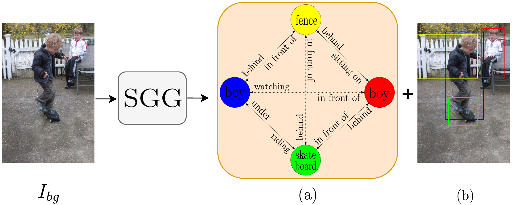

# GraPLUS: Graph-based Placement Using Semantics for Image Composition

[](https://arxiv.org/abs/2503.15761)
[](https://opensource.org/licenses/MIT)
[](https://www.python.org/downloads/release/python-360/)
[](https://pytorch.org/get-started/previous-versions/)

**Mir Mohammad Khaleghi, Mehran Safayani, Abdolreza Mirzaei**  
Department of Electrical and Computer Engineering, Isfahan University of Technology, Isfahan, Iran


## 📑 Table of Contents
- [Abstract](#abstract)  
- [Key Innovations](#-key-innovations)
- [Model Architecture](#-model-architecture)
- [Visual Comparisons](#-visual-comparisons)
- [Pre-trained Models](#-pre-trained-models)
- [Environment Setup](#-environment-setup)
- [Data Preparation](#-data-preparation)
- [Training](#-training)
- [Inference](#-inference)
- [Evaluation](#-evaluation)
- [Results](#-results)
- [Citation](#-citation)
- [Acknowledgements](#-acknowledgements)
- [Contact](#-contact)

## Abstract

We present GraPLUS, a novel framework for plausible object placement in images that leverages scene graphs and large language models. Our approach uniquely combines graph-structured scene representation with semantic understanding to determine contextually appropriate object positions. The framework employs GPT-2 to transform categorical node and edge labels into rich semantic embeddings that capture both definitional characteristics and typical spatial contexts, enabling nuanced understanding of object relationships and placement patterns.

GraPLUS achieves placement accuracy of 92.1% and an FID score of 28.83 on the OPA dataset, outperforming state-of-the-art methods by 8.1% while maintaining competitive visual quality. In human evaluation studies involving 964 samples assessed by 19 participants, our method was preferred in 52.1% of cases, significantly outperforming previous approaches.

## ✨ Key Innovations

- **Semantic-First Approach**: We determine optimal placement using only the foreground object's category without requiring the actual foreground image, significantly reducing computational complexity.

- **Transfer Learning**: We leverage pre-trained scene graph extraction models that incorporate cross-domain knowledge of common object relationships and spatial arrangements.

- **Edge-Aware Graph Neural Networks**: Our model processes scene semantics through structured relationships, preserving and enhancing semantic connections.

- **Cross-Modal Attention**: We align categorical embeddings with enhanced scene features through a dedicated attention mechanism.

- **Multi-Objective Training**: Our approach incorporates semantic consistency constraints alongside adversarial learning.

## 📊 Model Architecture

GraPLUS consists of four principal components:

1. **Scene Graph Processing**: Transforms background images into structured graph representations using a pre-trained Neural-MOTIFS model.

2. **Semantic Enhancement**: Maps nodes and edges to rich embeddings using GPT-2 and augments them with spatial information for more comprehensive scene understanding.

3. **Graph Transformer Network (GTN)**: Processes object-object interactions through edge-aware attention with a configurable number of heads and layers.

4. **Cross-Attention Module**: Computes attention weights between foreground object category and scene features to identify optimal placement locations.

This semantic-first design enables contextually appropriate object placements with improved coherence and accuracy compared to pixel-based methods.

## 🎯 Visual Comparisons

Below are some visual comparisons between our method and previous state-of-the-art approaches:


Each column represents a different method, and each row represents a different test case. The red outline indicates the predicted placement boundaries.

## ⏬ Pre-trained Models 

We provide models for **TERSE** (CVPR 2019) [[arXiv]](https://arxiv.org/abs/1904.05475), **PlaceNet** (ECCV 2020) [[paper]](https://www.ecva.net/papers/eccv_2020/papers_ECCV/papers/123580562.pdf), **GracoNet** (ECCV 2022) [[arXiv]](https://arxiv.org/abs/2207.11464), **CA-GAN** (ICME 2023, Oral) [[paper]](https://ieeexplore.ieee.org/stamp/stamp.jsp?tp=&arnumber=10219885), **CSANet** (BMVC 2024) [[paper]](https://papers.bmvc2024.org/0165.pdf), and our **GraPLUS**:

|     | Method   | User Study ↑ | Accuracy ↑ | FID ↓   | LPIPS ↑ | Model & Logs |
|-----|----------|------------|----------|--------|--------|---------------------|
| 0   | TERSE    | -          |   0.683  | 47.44  | 0.000  | [Google Drive](https://drive.google.com/file/d/1xxxxxxxxxxxxx/view?usp=sharing) |
| 1   | PlaceNet | -          |   0.684  | 37.63  | 0.160  | [Google Drive](https://drive.google.com/file/d/1xxxxxxxxxxxxx/view?usp=sharing) |
| 2   | [GracoNet](https://github.com/bcmi/GracoNet-Object-Placement) | 0.263 | 0.838 | 29.35 | 0.207 | [Google Drive](https://drive.google.com/file/d/1xxxxxxxxxxxxx/view?usp=sharing) |
| 3   | CA-GAN   | -          |   0.734  | 25.54  | 0.267  | [Google Drive](https://drive.google.com/file/d/1xxxxxxxxxxxxx/view?usp=sharing) |
| 4   | [CSANet](https://github.com/CodeGoat24/CSANet) | 0.216 | 0.803 | 22.42 | 0.264 | [Google Drive](https://drive.google.com/file/d/1xxxxxxxxxxxxx/view?usp=sharing) |
| 5   | GraPLUS  | **0.521**  | **0.921**| 28.83  | 0.055  | [Google Drive](https://drive.google.com/file/d/1xxxxxxxxxxxxx/view?usp=sharing) |

## 🔧 Environment Setup

### Prerequisites
- Python 3.6
- CUDA >= 10.2
- PyTorch 1.9.1

### Installation

1. Create and activate a conda environment:
```bash
conda create -n graplus python=3.6
conda activate graplus
```

2. Install PyTorch and related packages:
```bash
conda install pytorch==1.9.1 torchvision==0.10.1 torchaudio==0.9.1 cudatoolkit=10.2 -c pytorch
```

3. Install other dependencies:
```bash
pip install -r requirements.txt
```

4. Clone the repository:
```bash
git clone https://github.com/yourusername/GraPLUS.git
cd GraPLUS
```

## 🌓 Data Preparation

### OPA Dataset 
1. Download and extract [OPA](https://github.com/bcmi/Object-Placement-Assessment-Dataset-OPA) dataset:
   - [Google Drive](https://drive.google.com/file/d/133Wic_nSqfrIajDnnxwvGzjVti-7Y6PF/view?usp=sharing)
   - [Baidu Disk](https://pan.baidu.com/s/1IzVLcXWLFgFR4GAbxZUPkw) (code: a982)

2. Expected directory structure:
```
<PATH_TO_OPA>
  background/       # background images
  foreground/       # foreground images with masks
  composite/        # composite images with masks
  train_set.csv     # train annotation
  test_set.csv      # test annotation
```

3. Preprocess the data:
```bash
python tool/preprocess.py --data_root <PATH_TO_OPA>
```

4. After preprocessing, you'll have:
```
<PATH_TO_OPA>
  com_pic_testpos299/          # test set positive composite images (resized to 299)
  train_data.csv               # transformed train annotation
  train_data_pos.csv           # train annotation for positive samples
  test_data.csv                # transformed test annotation
  test_data_pos.csv            # test annotation for positive samples
  test_data_pos_unique.csv     # test annotation for positive samples with different fg/bg pairs 
```

### OPA Scene Graph Dataset



As illustrated above, our approach uses scene graphs to represent background images, capturing object relationships and their interactions. Nodes represent objects, edges represent relationships, and each object has a corresponding bounding box detection.

1. Download our pre-processed scene graph data:
   - [Google Drive](https://drive.google.com/file/d/1xxxxxxxxxxxxx/view?usp=sharing)

2. Extract the dataset to your designated scene graph directory (e.g., `<PATH_TO_SG_OPA>`). The structure should be:
```
<PATH_TO_SG_OPA>
  csg_background_20/          # Scene graphs with 20 nodes for background images
    <category>/                # Categories folders
      sg_<image_id>.json      # Scene graph for each background image
  ...
```

### GPT-2 Embeddings
1. Download our pre-computed GPT-2 embeddings:
   - [Google Drive](https://drive.google.com/file/d/1xxxxxxxxxxxxx/view?usp=sharing)

2. Extract to the `gpt2_embeddings` directory in your project:
```
gpt2_embeddings/
  node_embeddings.npy         # GPT-2 embeddings for object nodes
  edge_embeddings.npy         # GPT-2 embeddings for relation edges
```

## 💻 Training

### Basic Training
To train GraPLUS with default settings:

```bash
./train.sh graplus YOUR_EXPERIMENT_NAME --data_root <PATH_TO_OPA> --sg_root <PATH_TO_SG_OPA> --gpt2_path gpt2_embeddings
```

### Advanced Training Options
You can customize various parameters:

```bash
./train.sh graplus YOUR_EXPERIMENT_NAME \
  --batch_size 64 \
  --n_epochs 40 \
  --gtn_num_head 8 \
  --gtn_num_layer 5 \
  --gtn_hidden_dim 768 \
  --d_k 64 \
  --d_v 64 \
  --n_heads 8 \
  --data_augmentation True \
  --sampler_type "balance_sampler"
```

### Training Monitoring
To monitor the training progress:

```bash
tensorboard --logdir result/YOUR_EXPERIMENT_NAME/tblog --port YOUR_SPECIFIED_PORT
```

## 🔥 Inference

To generate composite images from a trained model:

```bash
./infer.sh YOUR_EXPERIMENT_NAME --epoch EPOCH_NUMBER --eval_type eval --data_root <PATH_TO_OPA> --sg_root <PATH_TO_SG_OPA> --gpt2_path gpt2_embeddings
```

### Using Pre-trained Models

1. Download the model from the provided link above
2. Extract it to the `result/` directory
3. Run:
```bash
./infer.sh YOUR_EXPERIMENT_NAME --epoch EPOCH_NUMBER --eval_type eval --data_root <PATH_TO_OPA> --sg_root <PATH_TO_SG_OPA> --gpt2_path gpt2_embeddings
```

The output composite images will be saved in `result/YOUR_EXPERIMENT_NAME/eval/EPOCH_NUMBER/`.

## 📊 Evaluation

### All-in-One Evaluation
To evaluate all metrics at once:

```bash
./eval.sh YOUR_EXPERIMENT_NAME EPOCH_NUMBER
```

This script will automatically evaluate:
- **Accuracy**: Uses a binary classifier to determine placement plausibility
- **FID**: Measures visual quality compared to ground truth
- **LPIPS**: Quantifies generation diversity

### Viewing Results
To view summarized evaluation results:

```bash
python tool/summarize.py --expid YOUR_EXPERIMENT_NAME --eval_type eval
python tool/summarize.py --expid YOUR_EXPERIMENT_NAME --eval_type evaluni
```

Results will be available at `result/YOUR_EXPERIMENT_NAME/*_resall.txt`.

## 📈 Results

### Quantitative Results
Our model outperforms previous methods across multiple metrics:

| Method   | User Study | Accuracy | FID    | Mean IoU | Center Dist. | Scale Ratio |
|----------|------------|----------|--------|----------|--------------|-------------|
| TERSE    | -          | 0.683    | 47.44  | 0.171    | 172.04       | 9.1%        |
| PlaceNet | -          | 0.684    | 37.63  | 0.194    | 144.77       | 12.0%       |
| GracoNet | 0.263      | 0.838    | 29.35  | 0.192    | 166.95       | 14.7%       |
| CA-GAN   | -          | 0.734    | 25.54  | 0.165    | 190.37       | 12.5%       |
| CSANet   | 0.216      | 0.803    | **22.42**  | 0.162    | 193.34       | 13.6%       |
| GraPLUS  | **0.521**  | **0.921**| 28.83  | **0.203**| **141.77**   | **16.5%**   |

### Ablation Studies
Our experiments validate key design choices:

| Component           | Accuracy | FID    | LPIPS  |
|---------------------|----------|--------|--------|
| Full Model          | **0.921**    | 28.83  | 0.055  |
| No Spatial Features | 0.899    | **25.35**  | **0.070**  |
| No Position Encoding| 0.812    | 31.70  | 0.054  |
| No Residual Conn.   | 0.828    | 30.80  | 0.056  |
| No Balanced Sampling| 0.873    | 29.14  | 0.053  |
| No Data Augmentation| 0.842    | 32.60  | 0.039  |

## 🖊️ Citation
If you find **GraPLUS** useful, please cite our paper:

```bibtex
@article{khaleghi2025graplus,
  title={GraPLUS: Graph-based Placement Using Semantics for Image Composition},
  author={Khaleghi, Mir Mohammad and Safayani, Mehran and Mirzaei, Abdolreza},
  journal={arXiv preprint arXiv:2503.15761},
  year={2025}
}
```

## 🙏 Acknowledgements
Our codebase builds upon several excellent works:
- [GracoNet](https://github.com/bcmi/GracoNet-Object-Placement)
- [CSANet](https://github.com/CodeGoat24/CSANet)

Additional components are borrowed and modified from:
- [Faster-RCNN-VG](https://github.com/shilrley6/Faster-R-CNN-with-model-pretrained-on-Visual-Genome)
- [OPA Dataset](https://github.com/bcmi/Object-Placement-Assessment-Dataset-OPA)
- [FID-Pytorch](https://github.com/mseitzer/pytorch-fid)
- [Perceptual Similarity](https://github.com/richzhang/PerceptualSimilarity)

## 📧 Contact
If you have any technical questions or suggestions, please open a new issue or feel free to contact:

- Mir Mohammad Khaleghi (m.khaleghi@ec.iut.ac.ir, mamadkhaleghi1994@gmail.com)
- Mehran Safayani (safayani@iut.ac.ir) - Corresponding author

## 📄 License
This project is released under the MIT License.
